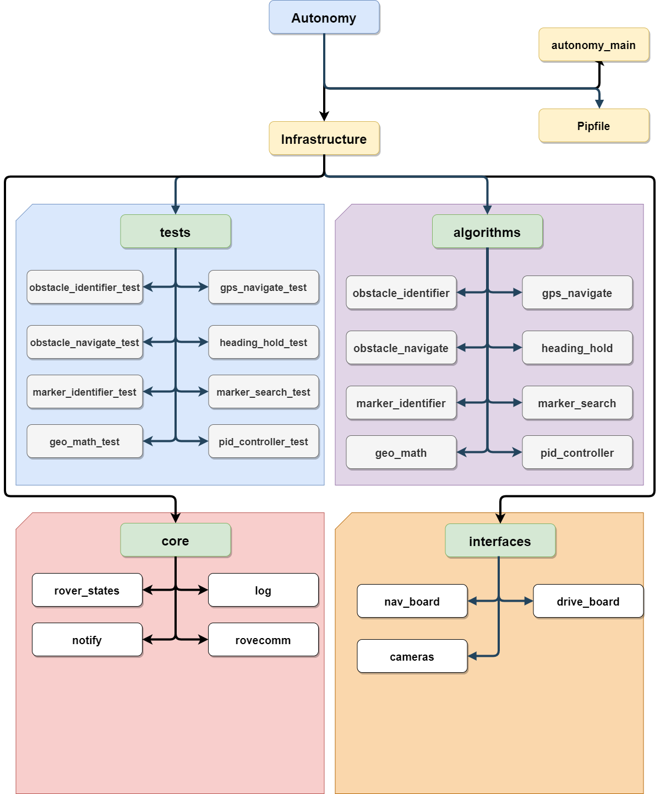

# Autonomy Software

This repo contains the Autonomy software stack for the current iteration of the MRDT Rover designed to compete at the University Rover Challenge. The software is developed to run on a Jetson TX2 development board.

## Getting Set Up
There are a couple of simple steps in order to get started writing software for the Autonomy system.

1. Clone the repo in an appropriate place. Standard practice is to clone it inside a directory such as RoverSoftware.
```
git clone https://github.com/MissouriMRDT/Autonomy_Software.git
```
2. Install Python 3.8 or higher, and then install pipenv using pip
```
pip install pipenv
```
3. Configure your python virtual environment (using pipenv) to install the required packages
```
pipenv install
```
4. Now that you have configured the virtual environment, if you want to run python code for the autonomy repo make sure to always do one of the following:
```
pipenv run <file you want to run>
```
or the preffered option which will spawn a shell subprocess with which you can start running commands within the environment: 
```
pipenv shell
```
5. You should now be set up (bar any issues), so go ahead and run our unit tests or linter using the following commands:
```
pytest --cov # unit tests and coverage

flake8 # linter used for code quality
```
These packages will be run by default for any push to dev/master and any pull request into dev/master to ensure the code quality matches our standards.

Any of the ZED (our chosen Stereo Cam) specific code will require the [ZED SDK](https://www.stereolabs.com/developers/release/), though you won't be able to run most code without an NVIDIA GPU.

## Recommended Tools:

IDE:

[Visual Studio Code](https://code.visualstudio.com/) w/ Python extension installed
To configure linting put the following in .vscode/settings.json:
```
"python.linting.pylintEnabled": false,
"python.linting.flake8Enabled": true,
"python.linting.lintOnSave": true,
"python.linting.enabled": true
```

Version Control:
1. [Github Desktop](https://desktop.github.com/)
2. [Git Bash](https://git-scm.com/downloads) & [Tortoise Git](https://tortoisegit.org/) (integration tips can be found [here](https://medium.com/@adriangodong/windows-git-bash-tortoisegit-1a866fbde27e))

## Architecture
The architecture is broken up into four categories:
1. Core - Contains all the core infrastructure of the Autonomy system, including the state machine, logging and networking with RoveComm.
2. Interfaces - Objects who wrap functionality of various components of the rover.
3. Algorithms - Core pieces of logic that perform the various computational taks that Autonomy requires, such as Haversine math, PID controls and Search pattern.
4. Tests - Broken into two subcategories: Unit and Integration tests. Unit tests are designed to test the basic functionality of any algorithm developed within the Autonomy system. These should be designed to easily test any changes made to an algorithm and should serve as a way to verify if changes broke functionality. Integration tests are designed to test various integration points with hardware accessories and other rover functionality.



## Contributing

Dev serves as the development branch throughout the school year. So if you want to start developing a feature or improvement create a banch based off of dev:
```
git pull
git checkout dev
git branch -b feature/<your feature name>
```
Every branch should contain the naming pattern feature/<feature name>. Once the feature has been developed and tested, create a Pull Request to merge your branches changes into dev. You can use the Github web interface for this. 

Pull requests will not be accepted if they cause unit tests to break or have syntatical errors. If you are adding a new algorithm, make sure to add a corresponding unit test, or it will most likely not be accepted.


