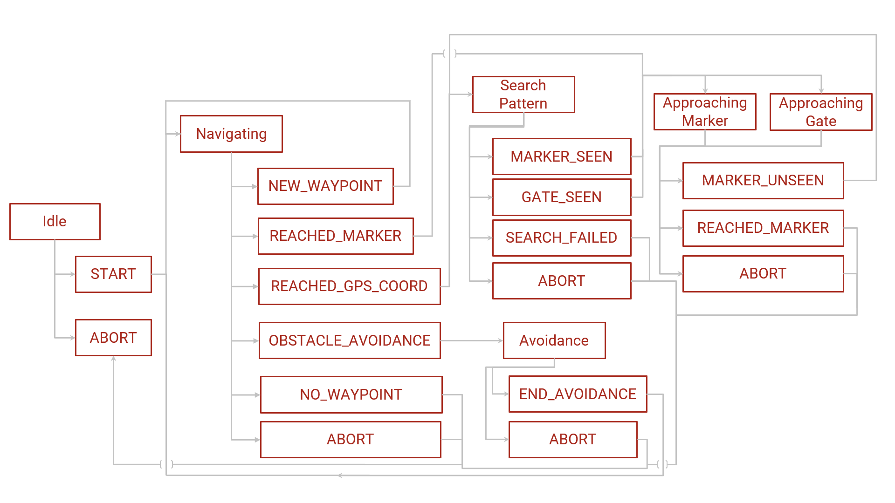

# Autonomy Software


This repo contains the Autonomy software stack for the current iteration of the Mars Rover Design Team's Rover designed
to compete at the University Rover Challenge. The software is developed to run on a Jetson Xavier NX development board.


2. Install Python 3.8, and then install pipenv using pip

```
pip install pipenv
```

3. Configure your python virtual environment (using pipenv) to install the required dev packages

```
pipenv install -d
```

4. Now that you have configured the virtual environment, if you want to run python code for the autonomy repo make sure
   to always do one of the following:

```
pipenv run <file you want to run>
```

or the preffered option which will spawn a shell subprocess with which you can start running commands within the
environment:

```
pipenv shell
```

5. You should now be set up (bar any issues), so go ahead and run our unit tests or linter using the following commands:

```
pytest --cov # unit tests and coverage

flake8 # linter used for code quality
```

These packages will be run by default for any push to dev/master and any pull request into dev/master to ensure the code
quality matches our standards.

6. To run the autonomy main code:

```
python run.py --file <file to run (you can ignore this if you want to run main autonomy)> --vision <change this to WEBCAM or NONE if you are running this on personal computer>
```

Any of the ZED (our chosen Stereo Cam) specific code will require
the [ZED SDK](https://www.stereolabs.com/developers/release/), though you won't be able to run most code without an
NVIDIA GPU. So use the --vision parameter if you don't have a camera or are using a webcam.

7. If you want to try running autonomy code in a simulator, check
   out [this repo](https://github.com/MissouriMRDT/Autonomy_Simulator) and associated documentation.

## Recommended Tools

### Integrated Development Environment (IDE):

While there are lots of options for your development environment, it is recommended that you use one listed below.

1. [Visual Studio Code](https://code.visualstudio.com/)
   w/ [Python extension](https://marketplace.visualstudio.com/items?itemName=ms-python.python) installed.
2. [PyCharm](https://www.jetbrains.com/pycharm/)

If using Visual Studio code it is also recommended that you use the settings.json located in .vscode/settings.json. If
not using VSCode it is recommended mimic some settings (the linting/formatting will help
greatly!)

### Version Control:

Just like development environments there are lots of options for version control, it is recommended that you use one
listed below.

1. [Github Desktop](https://desktop.github.com/)
2. [Git Bash](https://git-scm.com/downloads) & [Tortoise Git](https://tortoisegit.org/) (integration tips can be
   found [here](https://medium.com/@adriangodong/windows-git-bash-tortoisegit-1a866fbde27e))
3. [GitKraken](https://www.gitkraken.com/)

## Architecture

The architecture is broken up into four categories:

1. Core - Contains all the core infrastructure of the Autonomy system, including the state machine, logging and
   networking with RoveComm.
2. Interfaces - Objects who wrap functionality of various components of the rover.
3. Algorithms - Core pieces of logic that perform the various computational taks that Autonomy requires, such as
   Haversine math, PID controls and Search pattern.
4. Tests - Broken into two subcategories: Unit and Integration tests. Unit tests are designed to test the basic
   functionality of any algorithm developed within the Autonomy system. These should be designed to easily test any
   changes made to an algorithm and should serve as a way to verify if changes broke functionality. Integration tests
   are designed to test various integration points with hardware accessories and other rover functionality.

### Architecture Diagram


### State Machine Diagram


## Contributing
To learn more about contributing to Autonomy view [contributing.md](./docs/readme_resources/contributing.md).

Dev serves as the development branch throughout the school year. So if you want to start developing a feature or
improvement create a branch based off of dev:

```
git pull
git checkout dev
git branch -b feature/<your feature name>
```

Every branch should contain the naming pattern feature/<feature_name>. Once the feature has been developed and tested,
create a Pull Request to merge your branches changes into dev. You can use the GitHub web interface for this.

Once ready to test multiple new features together create a pull request from dev to release/testing. When the software
package for the year is complete create a pull request from release/testing into release/competition.

Pull requests will not be accepted if they cause unit tests to break or have syntactical errors. If you are adding a new
algorithm, make sure to add a corresponding unit test, or it will most likely not be accepted.

### Git Branch Graph


<!--
## Known Issues

To properly install pyyaml:

```
pip install --global-option='--with-libyaml' pyyaml
sudo apt-get install python-dev   # for python2.x installs
sudo apt-get install python3.8-dev  # for python3.8 installs
```

To properly install python-pcl:

2. copy over pcl/and egg files from usr/lib/python3/dist-packages to .local/share/virtualenvs/Autonomy_Software/lib/python3.8/site-packages/

3. ln -s _pcl.cpython-36m-x86_64-linux-gnu.so _pcl.so in the site-packages
-->
