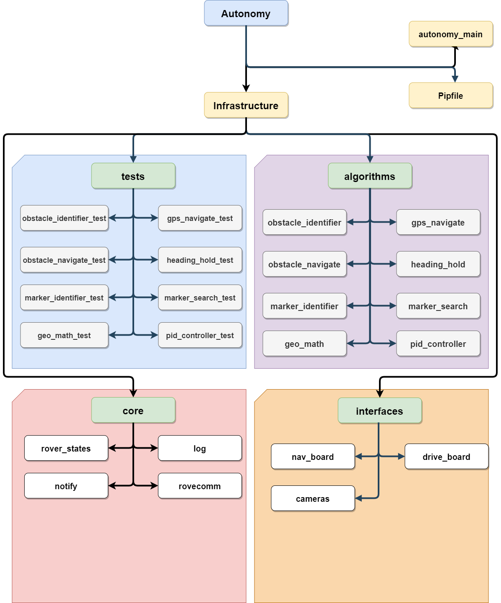
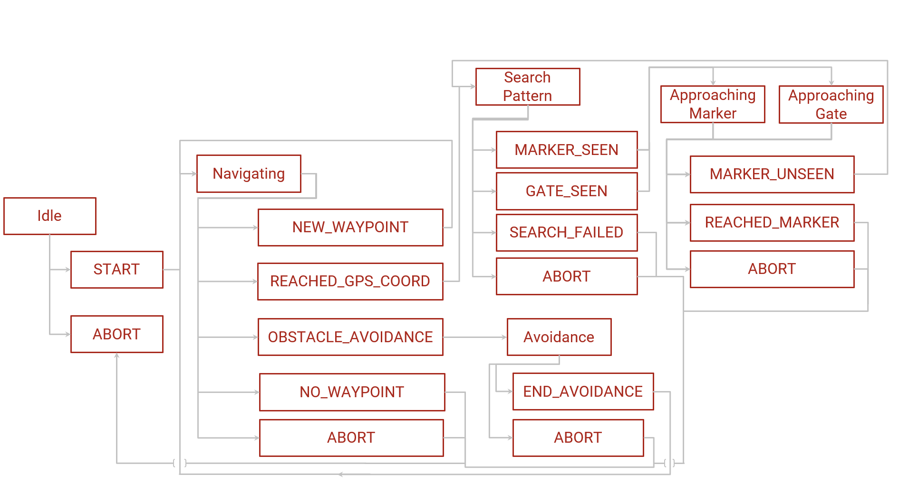

# Architecture
[Back to README.md](../../README.md)

The architecture is broken up into four categories:

1. Core - Contains all the core infrastructure of the Autonomy system, including the state machine, logging and
   networking with RoveComm.
2. Interfaces - Objects who wrap functionality of various components of the rover.
3. Algorithms - Core pieces of logic that perform the various computational tasks that Autonomy requires, such as
   Haversine math, PID controls and Search pattern.
4. Tests - Broken into two subcategories: Unit and Integration tests.
    - Unit tests are designed to test the basic
      functionality of any algorithm developed within the Autonomy system. These should be designed to easily test any
      changes made to an algorithm and should serve as a way to verify if changes broke functionality.
    - Integration tests
      are designed to test various integration points with hardware accessories and other rover functionality.

## Architecture Diagram

## State Machine Diagram

