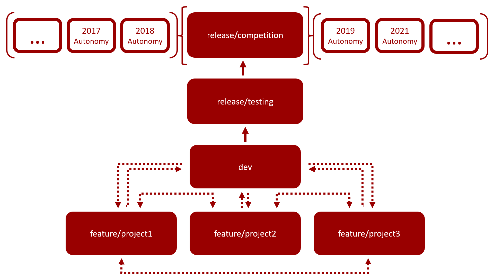

# Contributing

[Back to README.md](../../README.md)

Dev serves as the development branch throughout the school year. So if you want to start developing a feature or
improvement create a branch based off of dev:

```
git pull
git checkout dev
git branch -b feature/<your feature name>
```

Every branch should contain the naming pattern feature/<feature_name>. Once the feature has been developed and tested,
create a Pull Request to merge your branches changes into dev. You can use the GitHub web interface for this.

Once ready to test multiple new features together create a pull request from dev to release/testing. When the software
package for the year is complete create a pull request from release/testing into release/competition.

Pull requests will not be accepted if they cause unit tests to break or have syntactical errors. If you are adding a new
algorithm, make sure to add a corresponding unit test, or it will most likely not be accepted.

## Git Branch Graph

